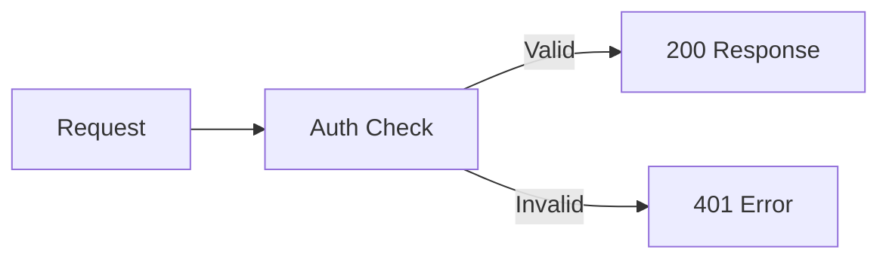

<Accordion title="Erreurs courantes" icon="fa-info-circle">

</Accordion>

<Cards>
  <Card title="Configuration en 5 minutes" icon="fa-rocket">
    De la clé API à la première requête
  </Card>

  <Card title="Démarrage rapide de l'API" icon="fa-code">
    Demandez votre clé API à notre équipe
  </Card>

  <Card title="Carte trois" icon="fa-comments">

  </Card>
</Cards>

<Banner
  isInline={true}
  message="This banner is displayed inline. Set isInline to false to move it seamlessly into your page's header!"
  color="#118cfd"
  textColor="#ffffff"
  fontSize="14px"
  fontWeight="bold"
 />