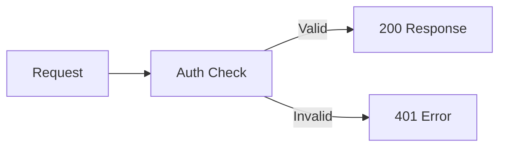

<Accordion title="일반적인 오류" icon="fa-info-circle">

</Accordion>

<Cards>
  <Card title="5분 설정" icon="fa-rocket">
    API 키 발급부터 첫 번째 요청까지
  </Card>

  <Card title="API 빠른 시작" icon="fa-code">
    저희 팀에 API 키를 요청하세요
  </Card>

  <Card title="카드 3" icon="fa-comments">

  </Card>
</Cards>

<Banner
  isInline={true}
  message="This banner is displayed inline. Set isInline to false to move it seamlessly into your page's header!"
  color="#118cfd"
  textColor="#ffffff"
  fontSize="14px"
  fontWeight="bold"
 />
