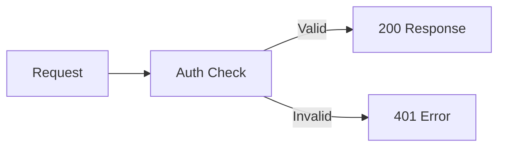

<Accordion title="Common Errors" icon="fa-info-circle">

</Accordion>

<Cards>
  <Card title="5 Minute Setup" icon="fa-rocket">

  </Card>

  <Card title="API Quick Start" icon="fa-code">

  </Card>

  <Card title="Card Three" icon="fa-comments">

  </Card>
</Cards>

