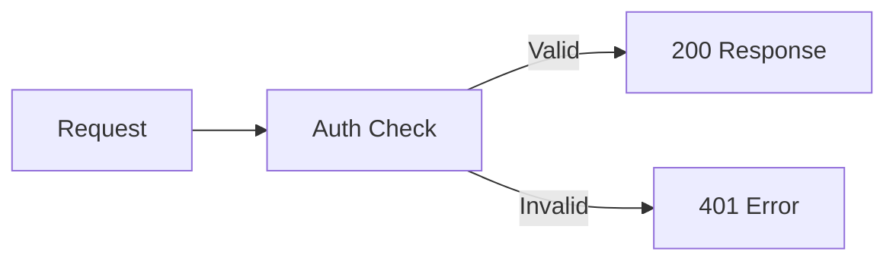

<Accordion title="Errori comuni" icon="fa-info-circle">

</Accordion>

<Cards>
  <Card title="Configurazione in 5 minuti" icon="fa-rocket">
    Dalla chiave API alla prima richiesta
  </Card>

  <Card title="Avvio rapido API" icon="fa-code">
    Richiedi la tua chiave API al nostro team
  </Card>

  <Card title="Scheda tre" icon="fa-comments">

  </Card>
</Cards>

<Banner
  isInline={true}
  message="This banner is displayed inline. Set isInline to false to move it seamlessly into your page's header!"
  color="#118cfd"
  textColor="#ffffff"
  fontSize="14px"
  fontWeight="bold"
 />