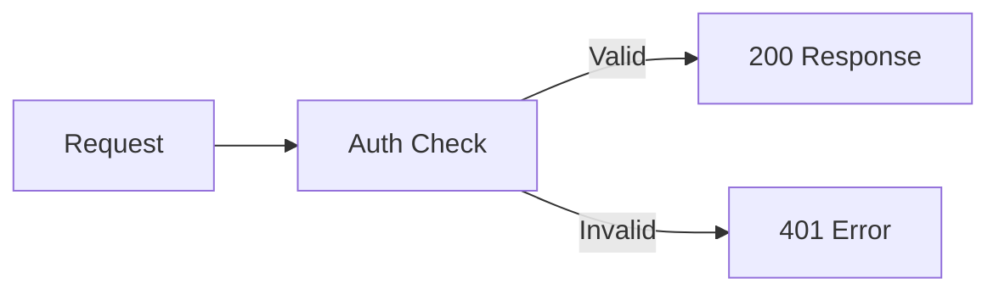

<Accordion title="Common Errors" icon="fa-info-circle">

</Accordion>

<Cards>
  <Card title="5 Minute Setup" icon="fa-rocket">
    From API key to first request
  </Card>

  <Card title="API Quick Start" icon="fa-code">
    Request your API key from our team
  </Card>

  <Card title="Card Three" icon="fa-comments">

  </Card>
</Cards>

<Banner
  isInline={true}
  message="This banner is displayed inline. Set isInline to false to move it seamlessly into your page's header!"
  color="#118cfd"
  textColor="#ffffff"
  fontSize="14px"
  fontWeight="bold"
 />
