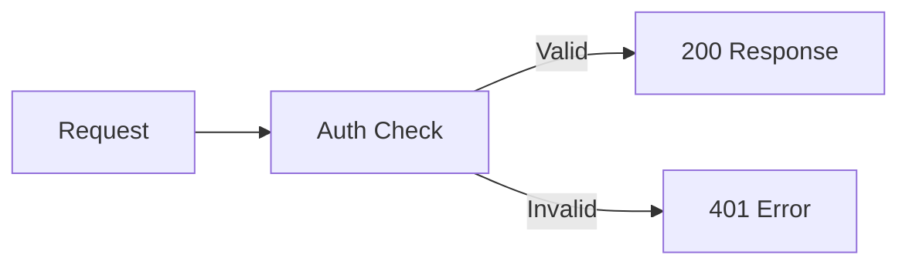

<Accordion title="Errores comunes" icon="fa-info-circle">

</Accordion>

<Cards>
  <Card title="Configuración en 5 minutos" icon="fa-rocket">
    Desde la clave de API hasta la primera solicitud
  </Card>

  <Card title="Inicio rápido de la API" icon="fa-code">
    Solicite su clave de API a nuestro equipo
  </Card>

  <Card title="Tarjeta tres" icon="fa-comments">

  </Card>
</Cards>

<Banner
  isInline={true}
  message="This banner is displayed inline. Set isInline to false to move it seamlessly into your page's header!"
  color="#118cfd"
  textColor="#ffffff"
  fontSize="14px"
  fontWeight="bold"
 />