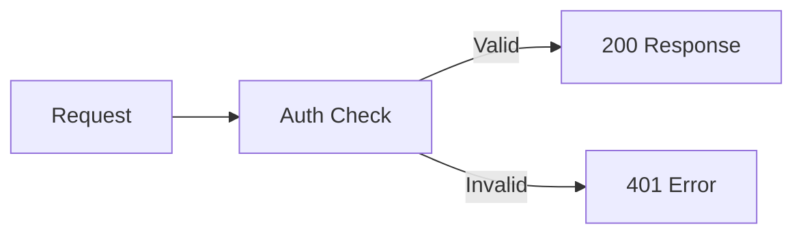

<Accordion title="常见错误" icon="fa-info-circle">

</Accordion>

<Cards>
  <Card title="5 分钟设置" icon="fa-rocket">
    从 API 密钥到首次请求
  </Card>

  <Card title="API 快速入门" icon="fa-code">
    向我们的团队申请您的 API 密钥
  </Card>

  <Card title="卡片三" icon="fa-comments">

  </Card>
</Cards>

<Banner
  isInline={true}
  message="This banner is displayed inline. Set isInline to false to move it seamlessly into your page's header!"
  color="#118cfd"
  textColor="#ffffff"
  fontSize="14px"
  fontWeight="bold"
 />