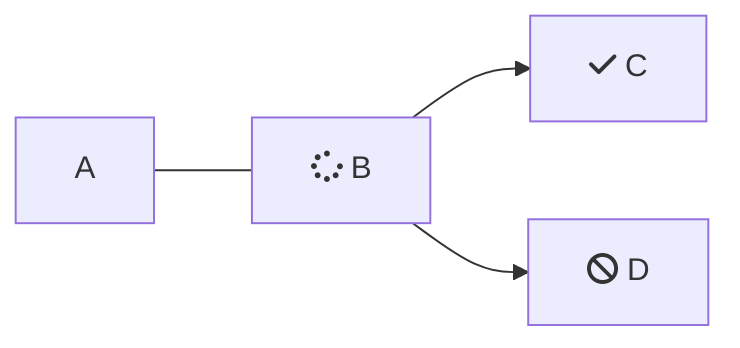

<Accordion title="" icon="fa-info-circle">
  Accordion Test
</Accordion>

<Cards>
  <Card title="Card One" icon="fa-rocket">
    Card Test
  </Card>

  <Card title="Card Two" icon="fa-code">

  </Card>

  <Card title="Card Three" icon="fa-comments">

  </Card>
</Cards>

