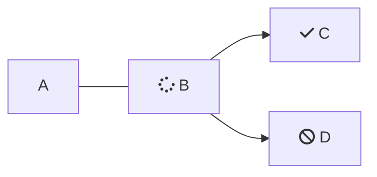

<Callout icon="📘" theme="info">

</Callout>

これは代表的なダミーテキストです。レイアウトやデザインを確認するために使用されます。実際のコンテンツが配置される前のプレースホルダーとして機能します。これは代表的なダミーテ

 

<Embed title="" typeOfEmbed="youtube" url="" />

 

キストです。レイアウトやデザインを確認するために使用されます。実際のコンテンツが配置される前のプレースホルダーとして機能します。

これは代表的なダミーテキストです。レイアウトやデザインを確認するために使用されます。実際のコンテンツが配置される前のプレースホルダーとして機能します。これは代表的なダミーテキストです。レイアウトやデザインを確認するために使用されます。実際のコンテンツが配置される前のプレースホルダーとして機能します。

これは代表的なダミーテキストです。レイアウトやデザインを確認するために使用されます。実際のコンテンツが配置される前のプレースホルダーとして機能します。これは代表的なダミーテキストです。レイアウトやデザインを確認するために使用されます。実際のコンテンツが配置される前のプレースホルダーとして機能します。

これは代表的なダミーテキストです。レイアウトやデザインを確認するために使用されます。実際のコンテンツが配置される前のプレースホルダーとして機能します。これは代表的なダミーテキストです。レイアウトやデザインを確認するために使用されます。実際のコンテンツが配置される前のプレースホルダーとして機能します。

これは代表的なダミーテキストです。レイアウトやデザインを確認するために使用されます。実際のコンテンツが配置される前のプレースホルダーとして機能します。これは代表的なダミーテキストです。レイアウトやデザインを確認するために使用されます。実際のコンテンツが配置される前のプレースホルダーとして機能します。

これは代表的なダミーテキストです。レイアウトやデザインを確認するために使用されます。実際のコンテンツが配置される前のプレースホルダーとして機能します。これは代表的なダミーテキストです。レイアウトやデザインを確認するために使用されます。実際のコンテンツが配置される前のプレースホルダーとして機能します。

これは代表的なダミーテキストです。レイアウトやデザインを確認するために使用されます。実際のコンテンツが配置される前のプレースホルダーとして機能します。これは代表的なダミーテキストです。レイアウトやデザインを確認するために使用されます。実際のコンテンツが配置される前のプレースホルダーとして機能します。

 