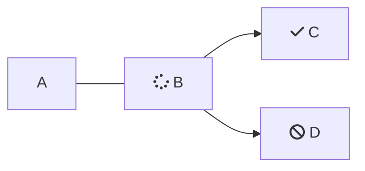

<Callout icon="📘" theme="info">

</Callout>

痛苦本身并不会带来痛苦

 

<Embed title="" typeOfEmbed="youtube" url="" />

 

，但由于某些特殊情况，痛苦和折磨往往会随之而来。为了获取一些微小的利益，我们有时不得不承受艰苦的劳动。除了从中获取一些好处外，谁会选择去从事那些痛苦的体力劳动呢？但是，谁又能指责一个选择享受快乐，而避免产生痛苦的人呢？

痛苦本身并不会带来痛苦，但由于某些特殊情况，痛苦和折磨往往会随之而来。为了获取一些微小的利益，我们有时不得不承受艰苦的劳动。除了从中获取一些好处外，谁会选择去从事那些痛苦的体力劳动呢？但是，谁又能指责一个选择享受快乐，而避免产生痛苦的人呢？

痛苦本身并不会带来痛苦，但由于某些特殊情况，痛苦和折磨往往会随之而来。为了获取一些微小的利益，我们有时不得不承受艰苦的劳动。除了从中获取一些好处外，谁会选择去从事那些痛苦的体力劳动呢？但是，谁又能指责一个选择享受快乐，而避免产生痛苦的人呢？

痛苦本身并不会带来痛苦，但由于某些特殊情况，痛苦和折磨往往会随之而来。为了获取一些微小的利益，我们有时不得不承受艰苦的劳动。除了从中获取一些好处外，谁会选择去从事那些痛苦的体力劳动呢？但是，谁又能指责一个选择享受快乐，而避免产生痛苦的人呢？

痛苦本身并不会带来痛苦，但由于某些特殊情况，痛苦和折磨往往会随之而来。为了获取一些微小的利益，我们有时不得不承受艰苦的劳动。除了从中获取一些好处外，谁会选择去从事那些痛苦的体力劳动呢？但是，谁又能指责一个选择享受快乐，而避免产生痛苦的人呢？

痛苦本身并不会带来痛苦，但由于某些特殊情况，痛苦和折磨往往会随之而来。为了获取一些微小的利益，我们有时不得不承受艰苦的劳动。除了从中获取一些好处外，谁会选择去从事那些痛苦的体力劳动呢？但是，谁又能指责一个选择享受快乐，而避免产生痛苦的人呢？

痛苦本身并不会带来痛苦，但由于某些特殊情况，痛苦和折磨往往会随之而来。为了获取一些微小的利益，我们有时不得不承受艰苦的劳动。除了从中获取一些好处外，谁会选择去从事那些痛苦的体力劳动呢？但是，谁又能指责一个选择享受快乐，而避免产生痛苦的人呢？

 